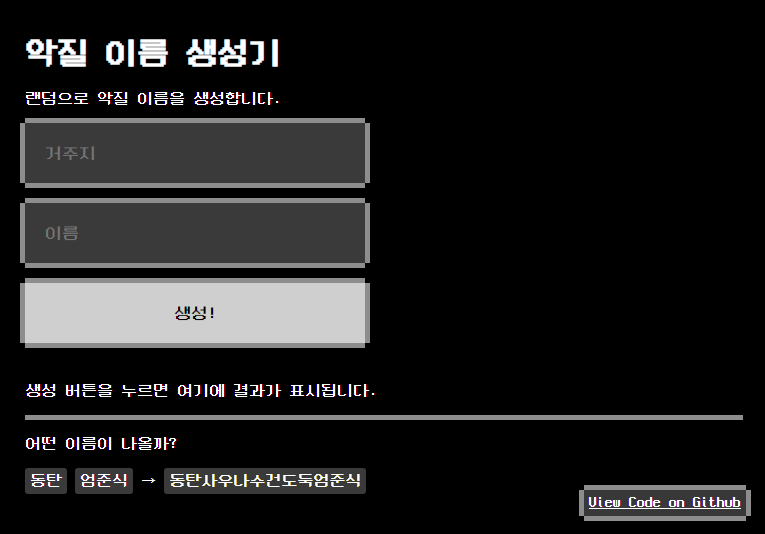

악질 이름 생성기
---
 

> 당신만의 악질 이름을 생성하세요.  

 * [사이트 이동](https://name.ho9.me)  
 * [악질 이름 생성기를 되돌아보며](https://medium.com/@kpjhg0124/%EC%95%85%EC%A7%88-%EC%9D%B4%EB%A6%84-%EC%83%9D%EC%84%B1%EA%B8%B0%EB%A5%BC-%EB%90%98%EB%8F%8C%EC%95%84%EB%B3%B4%EB%A9%B0-c767523b5d06)

### LICENSE
#### [악질 이름 생성기](https://github.com/ShapeLayer/prefix-generator)
[MIT LICENSE](https://github.com/ShapeLayer/prefix-generator/blob/master/LICENSE)
#### [Josa.js](https://github.com/e-/Josa.js/)
[MIT LICENSE](https://github.com/e-/Josa.js/blob/master/LICENSE)
#### [Neo둥근모](https://github.com/Dalgona/neodgm)
[SIL Open Font License 1.1](https://github.com/Dalgona/neodgm/blob/master/LICENSE.txt)
